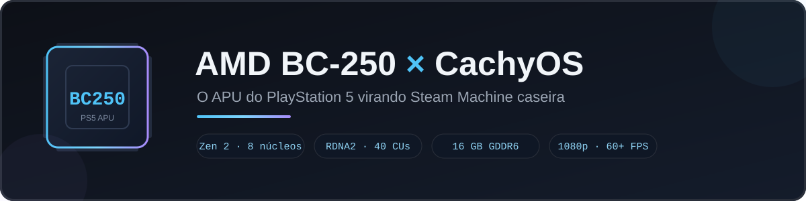
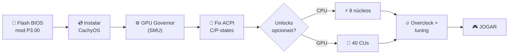

<div align="center">



# 🎮 BC-250 × CachyOS — Guia Definitivo de Gaming

**A placa ex-mineradora que esconde um APU de PlayStation 5 — destravada, otimizada e jogando em 1080p.**

[](docs/GUIA_BC250_CACHYOS_GAMING.md)
[](FAQ.md)
[](#-integridade-verificada)
[](https://cachyos.org)
[](LICENSE)

**Documentação de pesquisa** · atualizada em **setembro de 2026** · conteúdo 100% em **português (BR)**

</div>

> [!WARNING]
> **Resumo dos riscos antes de qualquer coisa.** A BC-250 é hardware **ex-minerador, vendido sem garantia**. Flashear a BIOS, destravar núcleos/CUs e fazer overclock têm **risco real de instabilidade ou dano permanente**. Este repositório documenta o caminho **mais seguro validado pela comunidade** — com hashes verificados e imagem de recuperação — mas **você é responsável** pela sua fonte, refrigeração e execução. **Nunca use Smokeless_UMAF** nesta placa.

> [!CAUTION]
> **Versão da BIOS — confira antes de flashear.** Este guia e os scripts usam a **mod P3.00 CHIPSETMENU** (padrão da comunidade), validada partindo de uma placa **stock P3.00**. As placas saíram em **P2.00 / P3.00 / P4.00 / P5.00** — e **todas aceitam a mod P3.00** (voltar à base P3.00 é intencional e seguro: é o que destrava VRAM dinâmica + menus de chipset).
>
> - 🔧 **Quer base P5.00 ou uma firmware customizada sua?** Não existem mods públicas para outras bases — a `P5.00_clv` (destrava tudo) circula **só no Discord, sem hash público** (confirme com ≥ 2 pessoas antes de usar). O caminho para montar a sua: **[Firmware Menu Script (Forbidden-Darkness)](https://github.com/Forbidden-Darkness/AMD-BC-250-UEFI-v2.2-Firmware-Menu-Script)** — backup + flash de firmware custom via menu interativo — combinado com módulos DXE da comunidade, como o **[BC250-DXE-SMU-Core-Unlock](https://github.com/RescueMei/BC250-DXE-SMU-Core-Unlock)** e o **[bc250-efi-core-unlock](https://github.com/Hexxeh/bc250-efi-core-unlock)**. Valide no **[Discord](https://discord.gg/8eZfFWhczz)** antes de gravar.
> - 💾 **ROMs stock de todas as versões (com hashes):** [GitLab TuxThePenguin0/bc250-bios](https://gitlab.com/TuxThePenguin0/bc250-bios/) · [kenavru/BC-250](https://github.com/kenavru/BC-250)
> - ☠️ **Nunca use Smokeless_UMAF** — risco de dano permanente.

---

## 🧠 O que é a BC-250?

A **AMD BC-250** é uma placa produzida em massa para **mineração de criptomoedas** que, na prática, carrega um **APU "cortado" do PlayStation 5**. A comunidade descobriu que o que foi cortado **não está danificado — está apenas bloqueado em firmware** — e aprendeu a destravar tudo por software, no Linux.

| Componente | De fábrica | Potencial destravado |
|---|:---|:---|
| 🧠 **CPU** | 6× Zen 2 @ ~3.5 GHz | **8 núcleos** (registro SMU `0x0115A870`) |
| 🎨 **GPU** | 24 CUs RDNA2 (*Cyan Skillfish*) | **40 CUs** (patch do driver `amdgpu`) |
| ⚡ **Memória** | 16 GB GDDR6 compartilhada | 10–12 GB usáveis como VRAM |
| 🔌 **E/S** | DisplayPort · 4× USB · GbE · M.2 NVMe/SATA | — |
| 🔋 **Energia** | PCIe 8-pin · ~220 W TDP | PSU 250 W+ no trilho 12 V |

**Resultado:** uma máquina **1080p médio/alto** no nível de uma **RX 6600 / GTX 1660 Ti** — por uma fração do custo de um PC gamer equivalente.

> [!IMPORTANT]
> **Só existe driver de GPU para Linux.** No Windows a placa não tem aceleração gráfica. Outras limitações: sem encode/decode de vídeo por hardware (VCN bloqueado pela Sony), sem WiFi/Bluetooth embutidos e consumo ocioso alto (~50–80 W).

---

## 📊 O que ela entrega (dados da comunidade)

| Cenário | Resultado |
|---|---|
| 🎮 **Cyberpunk 2077** | 60–90 FPS @ 1080p alto + FSR |
| 🎮 **DMC 5** | 100+ FPS @ 1080p alto |
| 🎮 **Control (ray tracing)** | ~40 FPS |
| ⚡ **Unlock de 8 núcleos** | **+27%** em multi-thread (7-zip) |
| 🎯 **Unlock de 40 CUs** | **1.61×** em compute (Vulkan) |
| 🤖 **LLM 8B (llama.cpp/Vulkan)** | ~60 tok/s |

<details>
<summary>📖 <strong>Por que isso é possível? (a história em 30 segundos)</strong></summary>

A Sony encomendou APUs da AMD para o PS5; sobras de produção com partes do die desabilitadas foram parar em placas de mineração da ASRock (a linha **BC**). Quando o fim da mineração de Ethereum derrubou os preços, a comunidade percebeu que a placa era, na prática, **um PS5 disfarçado**:

- Os **2 núcleos de CPU** faltantes são controlados por **um único registro SMU** (`0x0115A870`: `0x77` → `0xFF`);
- As **16 CUs** faltantes são reativadas com **dois registros** escritos na inicialização do driver (`CC_GC_SHADER_ARRAY_CONFIG` + `SPI_PG_ENABLE_STATIC_WGP_MASK`);
- A **BIOS de fábrica** esconde os menus úteis (VRAM, chipset) — a versão comunitária os destrava;
- As **tabelas ACPI** vêm quebradas (sem C-states/P-states) — um SSDT corrigido resolve.

Tudo isso está documentado, com comandos e scripts, no [guia completo](docs/GUIA_BC250_CACHYOS_GAMING.md).

</details>

---

## 🗺️ O caminho completo (mapa mental)



---

## 🚀 Começo rápido (TL;DR)

> [!TIP]
> Cada passo com comandos, avisos e alternativas está no **[guia completo](docs/GUIA_BC250_CACHYOS_GAMING.md)** — 15 seções, do flash da BIOS ao troubleshooting.

1. **🔧 Flash da BIOS** — grave a **mod P3.00** (hash ✔) via pendrive no EFI Shell (**caminho validado: `fs0:` + `flash-safe.nsh`**) e **limpe o CMOS** pelo jumper depois → seção 3
2. **🎛️ Configure a BIOS** — VRAM **512 MB dinâmico** · **IOMMU Disabled** · Boot UEFI → seção 4
3. **💿 Instale o CachyOS** — ISO padrão; kernel **6.18 LTS** ou **6.17.11+** (evite 6.15.0–6.15.6) → seção 5
4. **⚙️ Governor de GPU** — `cyan-skillfish-governor-smu` (funciona sem patch de kernel) → seção 6
5. **🔋 Fix ACPI** — tabelas SSDT 8-core para C-states/P-states (800–3200 MHz) → seção 7
6. **⚡ Opcional: unlocks + OC** — 8 núcleos, 40 CUs e curvas de tensão → seções 9–11
7. **🌬️ Case + refrigeração** — escolha ventoinha, pads de VRAM e case 3D (console-style ou **ATX**) → [guia de refrigeração](docs/GUIA_REFRIGERACAO_E_CASES.md)

**Automatize a pós-instalação (CachyOS):**

```bash
sudo bash scripts/setup-bc250-cachyos.sh
```

**Prepare o pendrive de flash (Windows):**

```powershell
.\scripts\make_flash_usb.ps1 -DriveLetter I
```

---

## 📦 O que tem neste repositório

```text
bc250-cachyos-gaming/
├── 📄 README.md                      ← você está aqui
├── ❓ FAQ.md                         ← 20+ perguntas frequentes
├── 📖 docs/
│   ├── GUIA_BC250_CACHYOS_GAMING.md  ← o guia completo (15 seções)
│   └── GUIA_REFRIGERACAO_E_CASES.md  ← refrigeração recomendada + cases 3D (ATX, console-style)
├── 🛠️ scripts/
│   ├── setup-bc250-cachyos.sh        ← pós-instalação no CachyOS (menu interativo)
│   ├── make_flash_usb.ps1            ← prepara o pendrive de flash no Windows (sem formatar)
│   └── make_html.py                  ← gera o guia em HTML autocontido
└── 🎨 assets/banner.svg
```

| Arquivo | Para quê |
|---|---|
| [docs/GUIA_BC250_CACHYOS_GAMING.md](docs/GUIA_BC250_CACHYOS_GAMING.md) | Guia passo a passo: BIOS, ACPI, governor, unlocks, overclock, troubleshooting e fontes |
| [docs/GUIA_REFRIGERACAO_E_CASES.md](docs/GUIA_REFRIGERACAO_E_CASES.md) | 🌬️ Refrigeração recomendada (fans, pasta, VRAM do backplate, PWM) + **catálogo de cases 3D** — incluindo os 7 projetos para **PSU ATX** |
| [FAQ.md](FAQ.md) | Perguntas frequentes organizadas por nível (iniciante → avançado) |
| [scripts/setup-bc250-cachyos.sh](scripts/setup-bc250-cachyos.sh) | Menu interativo: governor, sensores, ACPI, parâmetros de kernel, unlocks |
| [scripts/make_flash_usb.ps1](scripts/make_flash_usb.ps1) | Monta o pendrive de flash com **verificação de hash** e shell embutido — **não formata, não apaga** |
| [scripts/make_html.py](scripts/make_html.py) | Gera versão HTML do guia (tema escuro, zero recursos externos) |

> [!NOTE]
> **Deliberadamente fora do repositório:** os binários de BIOS (`.rom`, 16 MB) e o código-fonte dos projetos de terceiros. Por segurança e licenciamento, este repo **linka as fontes oficiais** e publica os **hashes de verificação** — baixe sempre da origem e confira o checksum.

---

## 🔐 Integridade verificada

Hashes conferidos durante a pesquisa (setembro/2026), cruzando múltiplas fontes públicas da comunidade:

| Arquivo | Tipo | SHA256 (primeiros/últimos caracteres) |
|---|---|---|
| `BC250_3.00_CHIPSETMENU.ROM` | **Mod P3.00** — recomendado | `48fbe5d3…40b5` |
| `BC250_3.00.ROM` | Stock P3.00 — imagem de recuperação | `07595ca3…045c` |
| `Robin5.00` (stock P5.00, embutido no kit) | Valida o kit inteiro | `0d6f136c…aa82` |

Confira sempre o seu download antes de flashear:

```bash
sha256sum BC250_3.00_CHIPSETMENU.ROM
# ou, no Windows:
Get-FileHash .\BC250_3.00_CHIPSETMENU.ROM -Algorithm SHA256
```

---

## ❓ FAQ — destaques

<details open>
<summary><strong>🖥️ Posso usar Windows?</strong></summary>

Não para gráficos — **não existe driver de GPU para Windows** nesta placa. Use Linux (CachyOS, Bazzite, Fedora…). O guia cobre o caminho CachyOS de ponta a ponta.

</details>

<details>
<summary><strong>⚡ Destravar 8 núcleos e 40 CUs é seguro?</strong></summary>

Os unlocks são **reversíveis por software** (o de núcleos se perde ao cortar a energia — o que é, na prática, uma rede de segurança). O risco real é **térmico/energético**: mais núcleos e CUs = mais calor e consumo. Nem toda placa tem todas as CUs saudáveis — rode os testes de health do unlock antes de confiar. Detalhes nas seções 9 e 10 do guia.

</details>

<details>
<summary><strong>🎮 Quantos FPS eu vou ter?</strong></summary>

Depende do jogo e do ajuste; como referência: Cyberpunk 60–90 FPS (1080p alto + FSR), DMC 5 100+ FPS, Control ~40 FPS com RT. A comunidade relata que o "sweet spot" custo/benefício fica em **GPU ~1600 MHz + CPU ~3500 MHz** — silencioso e fresco, com desempenho próximo do máximo.

</details>

<details>
<summary><strong>🐧 Bazzite ou CachyOS?</strong></summary>

**CachyOS** tende a dar a melhor performance (scheduler BORE + pacotes otimizados x86-64-v3), mas é Arch — exija alguma familiaridade. **Bazzite** é o caminho "console" (modo Steam, quase plug-and-play, kernel já com patches). O guia foca em CachyOS, que é a proposta deste repositório.

</details>

➡️ **[Todas as 20+ perguntas no FAQ.md](FAQ.md)**

---

## 🧩 Créditos — o ecossistema que tornou isso possível

Este material é uma **documentação independente em PT-BR** construída sobre o trabalho aberto de:

| Projeto | O que faz | ⭐ |
|---|---|---|
| [elektricM/amd-bc250-docs](https://github.com/elektricM/amd-bc250-docs) | Documentação viva da comunidade — base deste guia | 250+ |
| [mothenjoyer69/bc250-documentation](https://github.com/mothenjoyer69/bc250-documentation) | A documentação original do projeto | 550+ |
| [duggasco/bc250-40cu-unlock](https://github.com/duggasco/bc250-40cu-unlock) | Unlock das 40 CUs (kernel patch + scripts) | 370+ |
| [rw-r-r-0644/bc250-core-unlock](https://github.com/rw-r-r-0644/bc250-core-unlock) | Unlock dos 2 núcleos de CPU extras | 170+ |
| [WinnieLV/bc250-cu-live-manager](https://github.com/WinnieLV/bc250-cu-live-manager) | Gestão de CUs em runtime via UMR (TUI) | 190+ |
| [Forbidden-Darkness/…-Firmware-Menu-Script](https://github.com/Forbidden-Darkness/AMD-BC-250-UEFI-v2.2-Firmware-Menu-Script) | Menu UEFI: backup + flash de firmware | 120+ |
| [NexGen-3D-Printing/SteamMachine](https://github.com/NexGen-3D-Printing/SteamMachine) | Setup automatizado (referência Bazzite) | 135+ |
| [akandr/bc250](https://github.com/akandr/bc250) | Deep-dive de IA/LLM na BC-250 | 330+ |
| [redbeard1083/bc250-toolkit](https://github.com/redbeard1083/bc250-toolkit) | Toolkit de setup no CachyOS | 110+ |
| [bc250-collective/bc250_smu_oc](https://github.com/bc250-collective/bc250_smu_oc) | Overclock/undervolt de CPU via SMU | 65+ |
| [GabriWar/bc250-core-cu-unlock](https://github.com/GabriWar/bc250-core-cu-unlock) | Unlock de núcleos via Linux | — |
| [filippor/cyan-skillfish-governor](https://github.com/filippor/cyan-skillfish-governor) | Governor de GPU (SMU/TT) | — |
| [mendesrr/bc250-acpi-fix-updated-8c](https://github.com/mendesrr/bc250-acpi-fix-updated-8c) | Fix ACPI para 8 núcleos | — |
| [MastaG/linux-cachyos-bc250](https://github.com/MastaG/linux-cachyos-bc250) | Kernel CachyOS com patches BC-250 | 35+ |

⭐ = estrelas aproximadas em setembro/2026. **Passe lá e dê seu star** — o ecossistema vive disso.

**Comunidade:** [r/BC250Gaming](https://www.reddit.com/r/BC250Gaming/) · [Discord da BC-250](https://discord.gg/8eZfFWhczz)

---

## 📚 Fontes

<details>
<summary><strong>Documentação, fóruns, Reddit e YouTube</strong></summary>

- **Documentação oficial (referência viva):** [elektricM.github.io/amd-bc250-docs](https://elektricM.github.io/amd-bc250-docs/)
- **Tom's Hardware:** benchmark do BC-250 e o hack das 40 CUs
- **Linus Tech Tips:** build log "AMD BC 250 part two — the easy one"
- **Reddit:** [r/BC250Gaming](https://www.reddit.com/r/BC250Gaming/) — journeys de setup, fix ACPI, CachyOS vs Bazzite
- **CachyOS:** [wiki.cachyos.org](https://wiki.cachyos.org) · [discuss.cachyos.org](https://discuss.cachyos.org)
- **YouTube:** playlist *"The AMD BC-250"*
- **BIOS (fonte oficial dos binários):** [GitLab TuxThePenguin0/bc250-bios](https://gitlab.com/TuxThePenguin0/bc250-bios/)

</details>

---

## 🤝 Como contribuir

1. **Testou um jogo?** Abra uma issue com FPS, resolução e configuração — vira tabela no guia
2. **Achou algo desatualizado?** A plataforma evolui rápido; PRs bem-vindos
3. **Sua placa destravou 40 CUs?** Compartilhe o mapa de harvest com a comunidade
4. **Fala outro idioma?** Traduções são muito bem-vindas (EN/ES)

## 📄 Licença

[MIT](LICENSE) para o material original deste repositório. As fontes citadas mantêm suas próprias licenças (documentação da comunidade: CC BY-SA 4.0; código: MIT).

---

<div align="center">

**⚡ De mineradora aposentada a Steam Machine caseira — o hardware não escolhe o passado; a comunidade escolhe o futuro. ⚡**

*Feito com 🔧, ☕ e um APU de PS5 · setembro de 2026*

</div>
